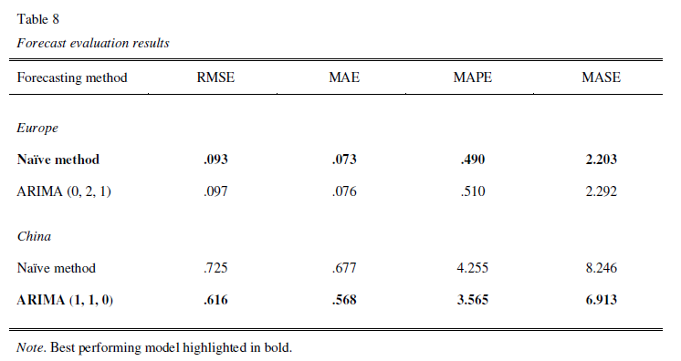
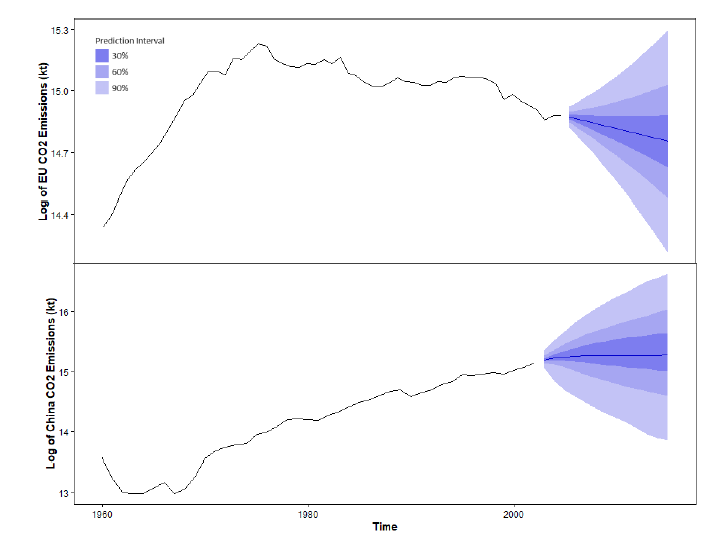

# Forecasting Carbon Dioxide Emissions of China, the United States, and the European Union: Comparing ARIMA and Naïve Predictions

## Background
* Earth climate changes become more apparent across the world, with scientists **attributing the rising temperatures primarily to carbon dioxide** emissions.
* The **top three emitters** by annual CO2 emissions in 2017 are **China** (27% of global emissions), the **United States** (US; 15%), and the **EU-27** (10%). 
* There is a strong need of **policymakers to monitor the current status** of the CO2 emissions as well as to **understand their trajectories** to design & implement effective policy responses.

## Objective
* Use forecasting methods to **forecast the CO2 emissions of the top 3 emitting countries or unions until 2030**.
* Demonstrate the **use and the limitations of ARIMA models** and share concrete steps to improve the predictions.

## Approach
* Apply **ARIMA methods following the Box-Jenkins-Approach** to generate univariate one-step ahead and 2030 forecasts. 
* **Benchmark** the method versus a simple naïve forecast and evaluate it thoroughly using **RMSE, MAE, MAPE, and MASE** measures.

## Key Results
* **(0, 2, 1), (1, 1, 0), and (0, 1, 1) ARIMA models** were used as final models for **EU, China, and US**, respectively. The EU and China model passed the residual checks. 
* The **naïve forecast outperformed the ARIMA forecast for Europe**, whereas the **ARIMA model performed better across measures for China**  (due to heteroscedasticity, the U.S. model was not used for forecasting; a GARCH model would be required):

* The **2030 forecast** for the EU and China is shown below:

* The Box-Jenkins-Approach appears to **not be well-suited for applied long-term predictions**. Future work should utilize more sophisticated methods (ensembles of statistical models, deep learning models that can model dependencies such as (bidirectional) LSTMs), utilize **cross-learning or multivariate models**, and include relevant **covariates** to improve the predictive performance of the model.

## Installation Instructions
* Install **R (4.2.1) and RStudio**
* Change the **data loading path** to your local working directory
* Run the script and consider reading the written report for in-depth insights
