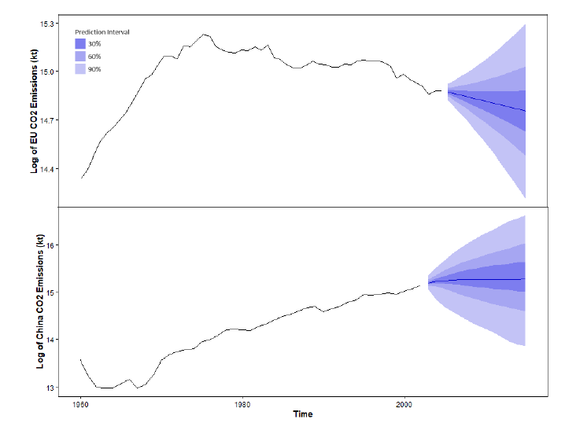

# Forecasting Carbon Dioxide Emissions of China, the United States, and the European Union: Comparing ARIMA and Naïve Predictions

## Background
* Earth climate changes become more apparent across the world, with scientists **attributing the rising temperatures primarily to carbon dioxide** emissions, and t o a lesser extend non-CO2 greenhouse gases (e.g., Methane, halogenated gases etc.). 
* The **top three emitters** by annual CO2 emissions in 2017 are **China** (27% of global emissions), the **United States** (US; 15%), and the **EU-27** (10%). 
* There is a strong need of **policymakers to monitor the current status** of the CO2 emissions as well as to **understand their trajectories** to design & implement effective policy responses.

## Objective
* Use forecasting methods to **forecast the CO2 emissions of the top 3 emitting countries or unions until 2030**.
* Derive **potential guidance** for policymakers to support the development of effective climate policy actions.
* Demonstrate the **use and the limitations of ARIMA models** and share concrete steps to improve the predictions.

## Approach
* Apply **ARIMA methods following the Box-Jenkins-Approach** to generate univariate one-step ahead and 2030 forecasts. 
* **Benchmark** the method versus a simple naive forecast and evaluate it thoroughly using **RMSE, MAE, MAPE, and MASE** measures.

## Key Results
* A **(0, 2, 1), (1, 1, 0), and (0, 1, 1) model** was used for the forecast evaluation for the **EU, China, and US**, respectively. 
The naive forecast outperformed the ARIMA forecast for Europe. 

Rendered Image/assets/images/electrocat.png
* The Box-Jenkins-Approach appears to **not be well-suited for applied long-term predictions**. Future work should utilize more sophisticated methods (ensembles of statistical models, deep learning models that can model dependencies such as (bidirectional) LSTMs), utilize **cross-learning or multivariate models**, and inclusion of relevant **covariates**.

## Installation Instructions
* Install **R (4.2.1) and RStudio**
* Change the **data loading path** to your local working directory
* Run the script and read the accompagnying written report
